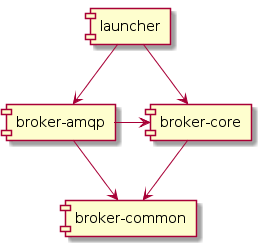
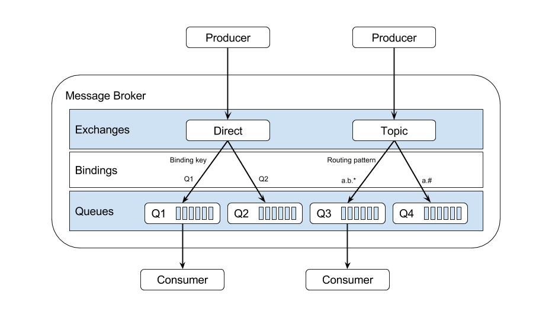
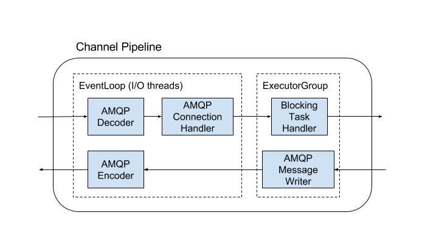

# Message Broker Architecture

## Module breakdown

### broker-common

This module contains all the classes that need to be shared between the broker-core and the transport modules.

### broker-core

This module implements core messaging semantics used by the different transport modules. Available broker semantics 
are influenced by the AMQP model. Both the queue and topic implementations are supported through the integration of 
AMQP elements; exchanges, binding, and queues. Please refer the section on AMQP architecture for more details on these 
concepts. This module only depends on the broker-common module.

### broker-amqp

AMQP transport in the message broker is implemented using Netty as the transport framework. This module depends on 
broker-core to provide the messaging capabilities.   

### launcher

Launcher is responsible for initializing and integrating different modules used in the message broker.

## AMQP Architecture

### Exchanges

Different exchange implementations define how the messages are routed to queues depending on the message's routing key
and other properties like message headers. Following is the main exchange types implemented in the broker. 
 
- **Direct exchange** - routes messages to a queue if its routing key exactly matches the queue name. The default exchange is a direct exchange.
- **Topic exchange** - routes messages depending on a routing pattern.

### Bindings

A binding is the relationship between an exchange and a message queue that tells the exchange how to
route messages.

### Queues

Message queue is a data storage where we keep messages in a FIFO order. A queue can have more than one consumer at a 
time. But for a topic it is more common to have a single consumer for each queue.

## Netty pipeline used in AMQP transport

### AMQP Decoder

TCP byte stream is decoded to AMQP frames at the AMQP Decoder class. A method registry is used internally to decide 
on the different frame types.

### AMQP Encoder

AMQP frames are converted to byte streams and published to network socket by the AMQP encoder.

### AMQP Message Writer

This class is responsible for writing frames for a message (method frame, header frame and content frame) in a 
ordered manner without mixing with other messages. 

### AMQP Connection Handler

AMQP Connection handler maintains the set of AMQP channels belonging to the current connection.

### Blocking Task Handler

This handler uses a different executor group than the other handlers. All the blocking tasks should be handled 
through this to avoid I/O threads getting blocked. Some examples for blocking tasks are database accessing methods 
calls, and synchronized method calls.
