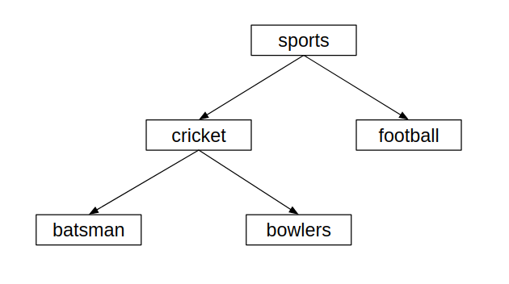

# Broker Authentication and Authorization

## Authentication

Message broker supports SASL PLAIN authentication for broker client connections. Clients can send the username and 
password over the wire in plaintext and connection can be protected by SSL.

Broker uses JAAS (Java Authentication and Authorization Service) apis to authenticate username and password of client
 connections. Authentication will be handled by the JAAS login modules.

Refer
 - [Changing the Default Security Settings](user/security-settings-guide.md)

## Authorization

Message broker supports authorization ( access control) by enforcing permissions on different actions performed on 
broker resources. Broker resources can be categorized into three groups as Exchanges,queues and binding Keys. 
Following table provides the resources and operations where permission will be evaluated.
 

| Action | Exchange | Queue |BindingKey |
| :---         |     :---:      |   :---:       | :---:       |
| Create   | ✓     |    ✓  |    |
| Delete     | ✓       |    ✓    |  
| Publish    |        |       |  ✓
| Consume     |        |    ✓    |  
| Bind     |        |       |  ✓ 
| Unbind     |       |       | ✓  
| Grant    | ✓       |     ✓   | ✓

Broker will have resources and resource group. As an example queue1 and queue2 will be two resources and they belongs
 to group called Queue.  So users can define permissions in there levels.

1) Resource Group
2) Per Resource
3) Hierarchical Topics

### Resource Group

This level can be used to control the operations of Exchanges,Queue and bindings in global level.

Ex.
Manager role can create,delete any queue.
Developer role uses can only consume queues.

### Per Resource
This level of authorization can be used to enforce action on specific resource.

Ex.
developer role can consume “developer”  queue and manager role users can consume messages in both “developer” and 
“manager” queues.

### Hierarchical Topics

This level will be applicable if authorization needs to be performed based on specific pattern. This will be used in 
Hierarchical topics. 

Ex.

Here any role has consume permission to sports topic will be able to consume messages in sports.cricket, sports
.cricket.batsman,sports.football etc. we can define that with wildcards as sports.#.

If role has consume permission on sports.cricket.batsman , given use will able to consume sports.cricket.batsman but 
not any other topics.

